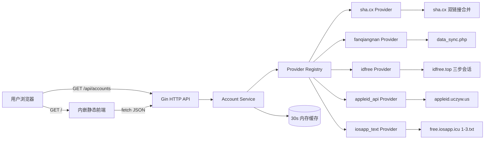

# AppleShare Hub 架构设计

## 1. 项目定位

AppleShare Hub 的目标是把多个来源、不同响应格式的苹果共享账号统一成一个稳定的分发状态服务：

- 用户访问网页即可看到账号可用状态。
- 前端和 API 只依赖统一的账号模型，不依赖具体渠道。
- 新增渠道时只实现一个 `Provider`，不改页面和对外接口。

## 2. 整体架构



## 3. 模块说明

### 3.1 `internal/model`

定义跨模块使用的数据模型：

- `Account`：统一账号字段，包括渠道、国家、用户名、密码、状态、状态说明、更新时间。
- `ChannelState`：渠道健康度，包括账号数量、错误信息、更新时间和按配置顺序生成的 `order`；前端据此固定映射为 A-F 字母。
- `Snapshot`：一次聚合响应，包含账号列表、渠道列表、安全提示、状态说明和汇总计数。
- `Warning`：页面和 API 共同使用的安全提示。

### 3.2 `internal/provider`

渠道适配层，是扩展其他账号渠道的关键接口：

```go
type Provider interface {
    ID() string
    Name() string
    Fetch(ctx context.Context) ([]model.Account, error)
}

type Factory func(cfg Config) (Provider, error)
```

`Provider` 只需要负责“从自己的上游获取并转换成 `model.Account`”。不同渠道的 API 响应、HTML 结构、状态码含义都封装在各自的 Provider 内。

当前已实现的渠道类型：

| Provider 类型 | 实现文件 | 上游特点 |
| --- | --- | --- |
| `sha_cx` | `shacx.go` | HTML 内嵌 JSON |
| `fanqiangnan` | `fanqiangnan.go` | 无鉴权 JSON |
| `idfree` | `idfree.go` | Cookie + X-Token + 浏览器头三步会话 |
| `appleid_api` | `appleid_api.go` | 无鉴权 JSON |
| `iosapp_text` | `iosapp_text.go` | 1-3 个纯文本文件，无检查时间，低优先级 |

新增渠道的步骤：

1. 在 `internal/provider` 下新建 `xxx.go`。
2. 实现 `Provider` 接口和 `Factory`。
3. 在 `init()` 或 `main` 中调用 `Register("xxx", factory)`。
4. 在 `config.json` 中增加一个 `providers` 配置项。
5. 前端和 API 无需改动。

### 3.3 `internal/service`

负责：

- 并发请求所有已启用渠道。
- 汇总账号、渠道状态和错误信息。
- 排序账号：可用账号排在前面。
- 渠道按配置顺序返回，渠道 A 固定在最前，前端只显示字母编号。
- 使用 30 秒内存缓存，避免用户访问高峰重复请求上游。
- 防止缓存过期时多个请求同时打上游（单飞行缓存刷新）。

如果某个渠道请求失败，服务仍会返回其他渠道的数据，并把该渠道标记为 `error`，同时在 `message` 中返回 `partial`。

### 3.4 `internal/httpapi`

Gin 路由层：

| 路由 | 说明 |
| --- | --- |
| `GET /` | 返回内嵌前端页面 |
| `GET /assets/*` | 返回前端静态资源与教程图片 |
| `GET /api/accounts` | 返回账号状态快照 |
| `GET /api/status` | 与 `/api/accounts` 相同，便于不同端接入 |
| `GET /healthz` | 健康检查 |

前端通过 `web/` 目录使用 `//go:embed` 编译进二进制，部署时不需要单独拷贝静态文件。

## 4. 数据流

1. 用户打开网页。
2. 前端请求 `GET /api/accounts`。
3. Gin handler 调用 `Service.Snapshot(ctx)`。
4. Service 检查缓存：有效则直接返回，失效则启动一次刷新。
5. Provider Registry 并发调用所有 Provider 的 `Fetch`。
6. 各 Provider 请求各自上游并转换成 `model.Account`。
7. Service 聚合结果、计算计数、写入缓存。
8. Gin 返回 JSON，前端渲染账号卡片、地区/渠道筛选、渠道健康度；账号列表在前端按每页 8 条分页。

## 5. 缓存策略

- 默认缓存 30 秒，可通过 `config.json` 的 `cache_ttl_seconds` 调整。
- 缓存内容为完整 `Snapshot`，包括账号和渠道状态。
- 缓存刷新使用单飞行模式：同一个时间窗口内只有一个刷新任务，其他请求等待该任务结果。
- 前端在收到响应后按 `cache_ttl_seconds` 自动安排下一次刷新。

## 6. API 约定

- 所有接口返回 JSON。
- `code = 200` 表示服务正常；`message = "partial"` 表示部分渠道失败。
- 账号状态统一为：

| status | 含义 |
| --- | --- |
| `available` | 可用 |
| `checking` | 检测中 |
| `pending` | 待检测 |
| `unavailable` | 异常 |
| `unknown` | 未知 |

- 前端通过 `status_legend` 渲染状态图例，不硬编码状态文案。

## 7. 安全与合规

- 账号密码由上游渠道提供，本项目不存储、不修改账号数据。
- 页面显著提示只在 App Store 登录、iOS 26 从设置退出。
- 不直接调用 Apple 登录接口批量验证账号，避免触发风控和锁机；可用性以上游检测时间与状态为准。
- 如接入的渠道需要密钥，建议把密钥放到环境变量或 `config.local.json`，不要提交到仓库。
- 建议部署在可信网络，并为对外服务配置 HTTPS 与访问频率限制。
