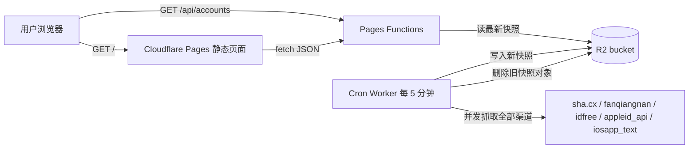

# AppleShare Hub Cloudflare Pages + R2 架构

## 1. 目标

本分支把原来的 Go + Gin 版本改造成可以在 Cloudflare 免费额度内运行的形式：

- 页面使用 **Cloudflare Pages** 托管，前端代码仍在 `web/`，无需改动。
- 数据使用 **Cloudflare R2** 存储，每次抓取后的完整账号快照写入 R2。
- 定时抓取由独立的 **Cloudflare Worker cron** 执行，不依赖 Pages 原生定时任务。
- 每次成功写入新快照后，会按策略清理 R2 中的旧快照对象。

Cloudflare Pages Functions 不能直接跑 Go 二进制，因此本分支把 5 个渠道适配器移植成了 JavaScript，逻辑与 Go 版保持一致：

| 渠道 | 类型 | 移植位置 |
| --- | --- | --- |
| sha.cx 双链接合并 | `sha_cx` | `functions/_lib/providers.js` |
| 翻墙男 | `fanqiangnan` | `functions/_lib/providers.js` |
| 小优 ID（三步会话） | `idfree` | `functions/_lib/providers.js` |
| 云码酷 | `appleid_api` | `functions/_lib/providers.js` |
| free.iosapp.icu 文本源 | `iosapp_text` | `functions/_lib/providers.js` |

## 2. 整体架构



核心原则：

1. 用户访问走 Pages 和 Pages Functions，只读 R2，不直接请求上游。
2. 抓取上游只在定时 Worker 中发生，避免用户访问高峰重复打上游。
3. R2 是唯一数据层，Worker 和 Functions 通过同一个 `BUCKET` binding 访问。
4. `/api/accounts` 使用 Cloudflare Cache API 写边缘缓存，默认 TTL 5 分钟；缓存命中时不会执行 Functions，也不会读 R2。

## 3. 目录结构

```text
.
├── web/                            # Pages 静态站点，直接复用原前端
├── functions/
│   ├── api/
│   │   ├── accounts.js             # GET /api/accounts，从 R2 读快照
│   │   ├── status.js               # GET /api/status，与 accounts 相同
│   │   └── refresh.js              # 手动/测试触发刷新（可带 token 保护）
│   └── _lib/
│       ├── config.js               # 从环境变量加载渠道配置，内置默认配置
│       ├── providers.js            # 5 个渠道的 JS 适配器
│       ├── snapshot.js             # 快照聚合、排序、计数、提示文案
│       ├── r2.js                   # R2 读取与 JSON 响应工具
│       └── refresh.js              # 抓取 + 写 R2 + 清理旧对象的核心逻辑
├── worker/
│   └── cron.js                     # Cloudflare Worker，支持定时触发
├── wrangler.toml                   # Pages 项目配置
├── wrangler.worker.toml            # Cron Worker 配置
├── cloudflare.config.example.json  # PROVIDER_CONFIG 示例
└── scripts/
    └── check-providers.mjs         # 本地直接验证 5 个渠道是否可抓取
```

## 4. R2 对象设计与清理策略

### 4.1 对象 Key

| Key | 说明 | 保留策略 |
| --- | --- | --- |
| `snapshot/latest.json` | 当前最新完整快照，`/api/accounts` 只读这个对象 | `put` 同 Key 自动覆盖，始终只有 1 份 |
| `snapshots/{timestamp}.json` | 可选历史快照 | 由 `RETAIN_HISTORY` 控制，默认不写入 |

### 4.2 抓取后清理流程

每次 `refresh()` 成功执行：

1. 并发抓取所有已启用渠道，构建统一 `Snapshot`。
2. 把新快照写入 `snapshot/latest.json`。
3. 如果 `RETAIN_HISTORY > 0`，先写入一个带时间戳的历史快照。
4. `BUCKET.list({ prefix: "snapshots/" })` 列出历史对象。
5. `RETAIN_HISTORY <= 0` 时删除全部历史对象；`RETAIN_HISTORY = N` 时只保留最新的 N 份。

这样每次抓取完成后，R2 里不会堆积“上一轮的无用快照”，只保留页面需要的最新数据和可配置的少量历史。

## 5. Pages Functions API

### `GET /api/accounts`

从 R2 读取 `snapshot/latest.json` 并原样返回，响应结构与 Go 版完全一致，包含 `accounts`、`channels`、`warnings`、`status_legend` 和计数。

响应头为 `Cache-Control: public, max-age=300, s-maxage=300`，并把响应写入 `caches.default`。5 分钟缓存窗口内，同一边缘节点的请求直接命中缓存，不执行 Functions。

### 5.1 缓存与轮询策略

- `cache_ttl_seconds` 默认 `300`，快照生成时写入 JSON，前端和接口都按这个值刷新。
- 前端默认每 5 分钟轮询一次；页面切到后台时暂停，回到前台后再拉取。
- 手动“刷新”按钮只重新请求 `/api/accounts`（带 `no-store` 绕过浏览器缓存），不会触发上游抓取，也不会修改 R2。
- 上游抓取只由 Cron Worker 每 5 分钟执行一次，用户请求始终读快照。

### `GET /api/status`

与 `/api/accounts` 相同，保留原项目的兼容路由。

### `GET|POST /api/refresh`

手动触发一次抓取并写入 R2。建议在环境变量里配置 `REFRESH_TOKEN`：

```bash
curl -X POST \
  -H "Authorization: Bearer <REFRESH_TOKEN>" \
  https://<pages-project>.pages.dev/api/refresh
```

未配置 `REFRESH_TOKEN` 时该接口可直接调用，仅用于本地开发和临时测试，生产环境必须配置。

## 6. Cron Worker

Cloudflare Pages 本身不支持原生 cron，因此定时抓取放在独立 Worker：

- 配置文件：`wrangler.worker.toml`
- 入口：`worker/cron.js`
- 默认触发：`*/5 * * * *`（每 5 分钟一次）
- Worker 与 Pages 共享同一个 `BUCKET` R2 binding，直接写 R2，不需要依赖 Pages 的公网 URL。

Worker 的 `fetch` 入口也实现了相同刷新逻辑，可以用于手动触发或健康检查，受 `REFRESH_TOKEN` 保护。

## 7. 环境变量

| 变量 | 默认值 | 说明 |
| --- | --- | --- |
| `PROVIDER_CONFIG` | 内置默认配置 | 渠道 JSON，格式见 `cloudflare.config.example.json`；在 Cloudflare 控制台配置时需是单行 JSON |
| `CACHE_TTL_SECONDS` | `300` | 前端轮询间隔、快照缓存标记与边缘缓存 TTL；若旧 `PROVIDER_CONFIG` 里仍写 30，请覆盖为 300 |
| `SNAPSHOT_KEY` | `snapshot/latest.json` | 最新快照对象 Key |
| `HISTORY_PREFIX` | `snapshots/` | 历史快照前缀 |
| `RETAIN_HISTORY` | `0` | 保留历史快照份数，`0` 表示每次刷新后删除全部历史 |
| `REFRESH_TOKEN` | 空 | 手动刷新接口/Worker fetch 的 Bearer token |

> 10 万用户量级的费用测算与后续优化思路见 [费用与调用优化](COST_OPTIMIZATION.md)。

## 8. 本地开发

环境要求：Node.js 18+，npm。

```bash
npm install
```

验证渠道抓取（不需要 R2）：

```bash
npm run check:providers
```

启动 Pages 本地开发服务器：

```bash
npm run pages:dev
```

也可以显式指定本地 R2 绑定：

```bash
npx wrangler pages dev web --r2 BUCKET=appleshare-hub
```

启动 Cron Worker 本地开发并模拟定时触发：

```bash
npm run worker:dev
```

## 9. 部署步骤

### 9.1 创建 R2 Bucket

```bash
npx wrangler r2 bucket create appleshare-hub
```

### 9.2 部署 Pages

方式一：命令行直接部署

```bash
npm run pages:deploy
```

`pages:deploy` 显式使用 `--branch main`，确保直接部署到 Production 域名（`<project>.pages.dev` 和自定义域名）。如果你只想发布 Preview，可手动执行：

```bash
npx wrangler pages deploy web --branch cloudflare-r2
```

方式二：在 Cloudflare Dashboard 创建 Pages 项目，连接本仓库并选择 `cloudflare-r2` 分支，构建输出目录填 `web`。

### 9.3 配置 Pages 的 R2 Binding

在 Pages 项目的 `Settings > Functions > R2 bucket bindings` 中新增：

- 变量名：`BUCKET`
- 选择 bucket：`appleshare-hub`

`wrangler.toml` 中已写入同名 binding，命令行部署时会一起生效。

### 9.4 配置环境变量

在 Pages 项目和 Cron Worker 中分别添加：

- `PROVIDER_CONFIG`：把 `cloudflare.config.example.json` 的内容压缩成单行 JSON 填入。
- `REFRESH_TOKEN`：生成一个随机字符串。
- 可选：`RETAIN_HISTORY`、`SNAPSHOT_KEY`、`HISTORY_PREFIX`。

### 9.5 部署 Cron Worker

```bash
npm run worker:deploy
```

部署后到 Worker 的 `Triggers > Cron Triggers` 确认 `*/5 * * * *` 已生效，并确认 Worker 的 R2 binding 也指向 `appleshare-hub`。

## 10. 与 Go 版的关系

- `main` 分支仍是 Go + Gin 版本，逻辑、配置、前端保持不变。
- `cloudflare-r2` 分支新增 Cloudflare 相关文件，不改动 Go 版本。
- 两版前端共用 `web/`，API 响应结构一致，后续新增渠道时 Go 版和 JS 版需要各自实现对应 Provider。

## 11. 安全与合规

- 账号密码只保存在 R2 快照中，不要写入日志；Worker 日志只输出数量和 Key 数量。
- 生产环境必须配置 `REFRESH_TOKEN`，避免 `/api/refresh` 被公开滥用。
- R2 bucket 建议只在 Cloudflare 内网通过绑定访问，不要公开到互联网。
- 继续保留页面上“只在 App Store 登录、iOS 26 从设置退出”的提示。
