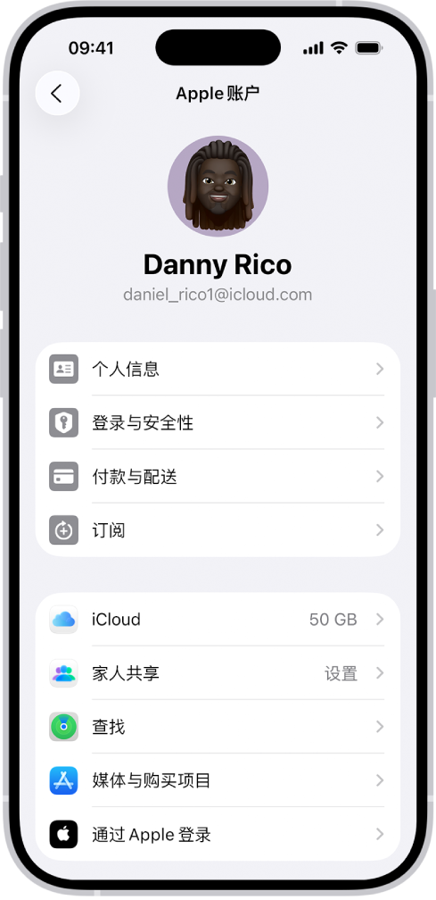

# iOS 26 苹果账号登录与退出教程

## 1. 核心原则

AppleShare Hub 分发的账号是共享 Apple ID，仅用于 **App Store 下载 App**。

- 不要在 **设置 / iCloud / App 与网站** 中登录。
- 不要修改账号密码、安全信息或开启双重认证。
- 使用完成后必须退出，且 iOS 26 的退出入口已经不在 App Store 页面中，需要到设置里操作。

## 2. 登录方式

### 方式一：App Store 内登录

1. 打开 **App Store**。
2. 点击右上角 **头像图标**。
3. 选择 **使用 Apple 账户登录**。
4. 输入 AppleShare Hub 页面展示的 Apple ID 与密码。
5. 如果系统询问“是否更新 Apple ID 设置”，选择 **暂不更新 / 稍后**。

### 方式二：设置中登录

1. 打开 **设置**。
2. 点击顶部 **你的姓名 / Apple 账户**。
3. 选择 **媒体与购买项目**。
4. 输入 Apple ID 与密码登录。

## 3. iOS 26 退出方式

iOS 26 及之后版本，App Store 页面内不再提供媒体与购买项目退出入口，需要按以下路径退出：

1. 打开 **设置**。
2. 点击顶部 **你的姓名 / Apple 账户**。
3. 选择 **媒体与购买项目**。
4. 点击 **退出登录**。
5. 确认退出。

## 4. 为什么要去设置退出

媒体与购买项目账号属于 Apple 账户体系中的“媒体与购买项目”部分。iOS 26 把该部分的管理入口统一到了系统设置，App Store 内只保留下载与购买入口。如果在 App Store 里找不到退出按钮，或退出时提示需要前往设置，都是正常现象，请直接按上面的路径操作。

## 5. 使用检查清单

- [ ] 只在 App Store 或 设置 > 媒体与购买项目 登录。
- [ ] 登录后先确认页面状态为“可用”。
- [ ] 下载完成后立即去设置退出。
- [ ] 退出后不要在同一设备上继续使用 iCloud 登录该账号。

## 6. 官方参考

- Apple 支持：使用其他 Apple 账户登录媒体与购买项目：<https://support.apple.com/zh-cn/118294>
- iPhone 使用手册：媒体与购买项目设置：<https://support.apple.com/zh-cn/guide/iphone/iph76e54c61e/ios>

## 7. 免责声明

本教程仅为 Apple 官方使用路径的整理，不构成安全保证。共享账号使用不当可能导致 Apple 账户被锁定、设备被锁或造成其他损失，请谨慎使用。
